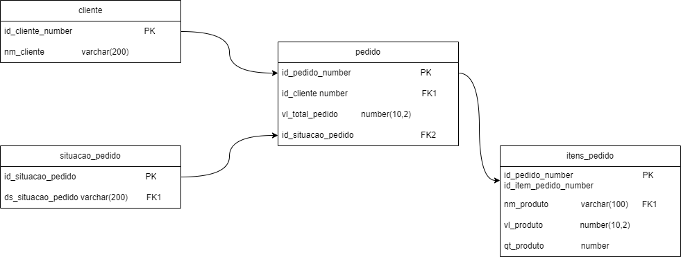

Estudo de caso - Analista de Dados Pleno - 3Core
=============================================================

## Diagrama ER
O modelo abaixo é a representação lógica do modelo de dados para o processo de **VENDAS**, incluindo as tabelas, colunas, tipos de dados dos campos, restrições, chaves primárias (PK) e estrangeiras (FK).



<details open>
  <summary>
    <strong>Descrição dos Relacionamentos:</strong>
  </summary>

- **Clientes** (`id_cliente` PK)  **1 : N**  **Pedidos** (`id_cliente` FK1): Cada *Cliente* pode ter múltiplos *Pedidos* registrados. O campo `id_cliente` na tabela *Pedidos* é uma chave estrangeira (FK1) que faz referência à chave primária (`id_cliente`) da tabela *Clientes*.

- **Situação_Pedido** (`id_situacao_pedido` PK)  **1 : N**  **Pedidos** (`id_situacao_pedido` FK1): Cada *Pedido* está associado a uma *Situação_Pedido*, onde `id_situacao_pedido` é a chave primária na tabela *Situação_Pedido*, referenciada como chave estrangeira (FK1) na tabela *Pedidos*.

- **Pedidos** (`id_pedido` PK)  **1 : N**  **Itens_Pedido** (`id_pedido`, `id_item_pedido` PK): Um *Pedido* pode ter 1 ou mais *Itens_Pedido*. Na tabela *Itens_Pedido*, a chave primária é composta por `id_pedido` (chave estrangeira que referencia *Pedidos*) e `id_item_pedido`, que garante a unicidade de cada item dentro de um pedido.
</details>


<details open>
  <summary>
    <strong>Responda usando raciocínio lógico ou SQL:</strong>
  </summary>

1. ### **Como você faria para contar quantos itens de pedido existe para cada pedido?**
    ```sql
        SELECT
            p.id_pedido,
            COUNT(ip.id_item_pedido) AS QTD_ITENS_POR_PEDIDO
        FROM
            pedidos p
        LEFT JOIN itens_pedido ip ON p.id_pedido = ip.id_pedido
        GROUP BY
            p.id_pedido
        HAVING
            COUNT(ip.id_item_pedido) > 0
        ORDER BY
            COUNT(ip.id_item_pedido) DESC;


2. ### **Quantos pedidos existem com a situação: “pendente entrega”?**
    ```sql
        SELECT
            DISTINCT p.id_pedido,
            COUNT(DISTINCT p.id_pedido) AS QTD_PEDIDOS_PENDENTES
        FROM
            pedidos p
        WHERE
            p.id_situacao_pedido = “pendente entrega”
        GROUP BY
            p.id_pedido
        ORDER BY
            QTD_PEDIDOS_PENDENTES DESC;


3. ### **Qual a média de número de pedidos por cliente?**
    ```sql
        WITH PEDIDOS_POR_CLIENTE AS (
            SELECT
                p.id_cliente,
                COUNT(*) AS QDT_PEDIDOS
            FROM
                pedidos p
            GROUP BY
                p.id_cliente
        )
        SELECT
            c.nm_cliente,
            AVG(p.QDT_PEDIDOS) AS MEDIA_PEDIDOS_POR_CLIENTE
        FROM
            PEDIDOS_POR_CLIENTE p
        LEFT JOIN clientes c ON p.id_cliente = c.id_cliente
        GROUP BY
            p.id_cliente
        ORDER BY
            AVG(p.QDT_PEDIDOS) DESC;


4. ### **Com base no resultado da primeira questão, quantos pedidos possuem mais de 5 itens?**
    ```sql
        WITH RESPOSTA_ITEM_1 AS (
            SELECT
                p.id_pedido,
                COUNT(ip.id_item_pedido) AS QTD_ITENS_POR_PEDIDO
            FROM
                pedidos p
            LEFT JOIN itens_pedido ip ON p.id_pedido = ip.id_pedido
            GROUP BY
                p.id_pedido
        )
        SELECT
            *
        FROM
            RESPOSTA_ITEM_1
        GROUP BY
            1, 2
        HAVING
            QTD_ITENS_POR_PEDIDO > 5
        ORDER BY
            QTD_ITENS_POR_PEDIDO ASC;


5. ### **Qual o valor médio que é vendido cada produto?**

    ```sql
        -- Opção mais ad-hoc
        SELECT
            ip.id_item_pedido,
            ip.nm_produto,
            SUM(ip.vl_produto) / NULLIF(COUNT(*), 0) AS MEDIA_VALOR_VENDA
        FROM pedidos p
        LEFT JOIN itens_pedido ip ON p.id_pedido = ip.id_pedido
        GROUP BY ip.id_item_pedido
        HAVING SUM(ip.vl_produto) > 0
        ORDER BY MEDIA_VALOR_VENDA DESC ;


        -- A forma como realmente procuro escrever SQL no meu dia a dia,
        -- aplicando SQLFLUFF para garantir o padrão de escrita e facilitar manutensões.
        SELECT
            ip.id_item_pedido,
            SUM(ip.vl_produto) / NULLIF(COUNT(*), 0) AS MEDIA_VALOR_VENDA
        FROM
            pedido p
            LEFT JOIN itens_pedido ip ON p.id_pedido = ip.id_pedido
        GROUP BY
            ip.id_item_pedido
        HAVING
            SUM(ip.vl_produto) > 0
        ORDER BY
            MEDIA_VALOR_VENDA DESC;

        WITH VALOR_TOTAL AS (
            SELECT
                ip.id_item_pedido,
                SUM(ip.vl_produto) AS VALOR_TOTAL
            FROM
                pedido p
                LEFT JOIN itens_pedido ip ON p.id_pedido = ip.id_pedido
            GROUP BY
                ip.id_item_pedido
            HAVING
                SUM(ip.vl_produto) > 0
        ),
        QTD_VENDIDA AS (
            SELECT
                ip.id_item_pedido,
                COUNT(*) AS QTD_VENDIDA
            FROM
                pedido p
                LEFT JOIN itens_pedido ip ON p.id_pedido = ip.id_pedido
            GROUP BY
                ip.id_item_pedido
            HAVING
                COUNT(*) > 0
        )
        SELECT
            vl.id_item_pedido,
            (vl.VALOR_TOTAL / qv.QTD_VENDIDA) AS MEDIA_VALOR_VENDA_POR_ITEM
        FROM
            VALOR_TOTAL vl
            INNER JOIN QTD_VENDIDA qv ON vl.id_item_pedido = qv.id_item_pedido
        ORDER BY
            MEDIA_VALOR_VENDA_POR_ITEM DESC;

</details>